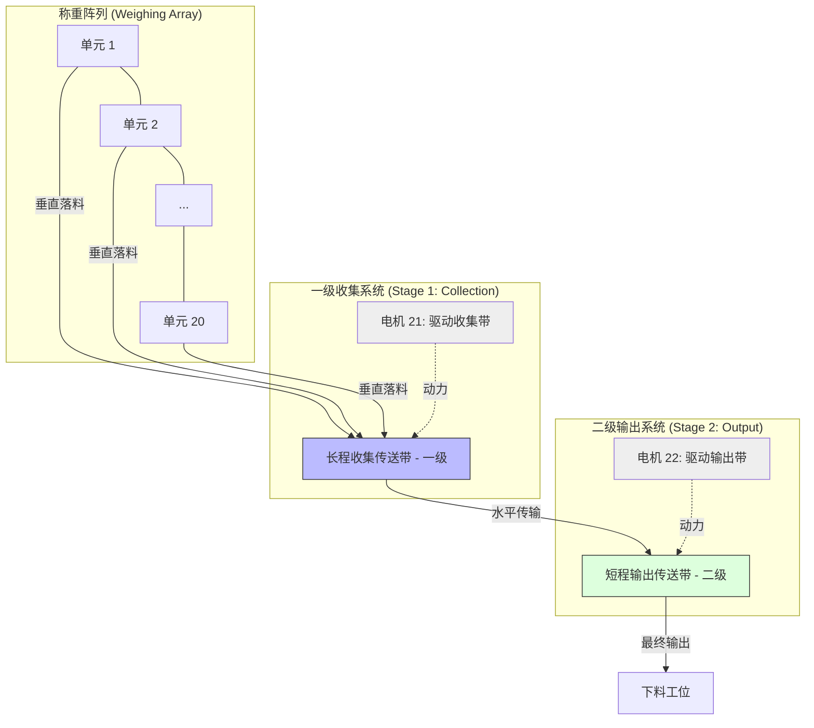

# 组合秤机械布局与硬件指南

本文档描述了 20 个称重单元与双级输送带系统的物理排列及工作原理。

## 1. 物理布局 (Physical Layout)

整个系统采用**直线阵列**布局，由 20 个独立的称重单元组成。

### 1.1 机械运作流程
- **直线排列**：20 个称重料斗沿直线等间距排列，方便 RS485 总线手拉手串联。
- **阶梯式双皮带系统**：
  - **Belt 1 (收集带)**：全长覆盖称重阵列下方。当组合引擎得出结果并落料后，收集带运行将物料汇聚至末端。
  - **Belt 2 (输出带)**：位于收集带末端下方，负责将每组组合后的物料步进式输出至包装工位。
- **伺服控制**：采用 Modbus 伺服电机实现精确位移，确保物料传输的节奏与包装机同步。

---

## 2. 电气定义 (Electrical Definitions)

为了方便维护，所有的 GPIO 引脚、RS485 寄存器地址以及电机 ID 均已统一提取到代码头文件中。

- **核心引脚定义**: 见 [PinDefinition.h](file:///src/PinDefinition.h)
- **Modbus 总线 ID**:
  - 称重单元: 1 - 20
  - 传送带 1: 21
  - 传送带 2: 22

---

## 3. 注意事项
- **电源管理**: 由于 20 个称重单元和 2 个伺服电机共用总线，请务必确保 24V 供电功率充足，并做好屏蔽层接地处理。
- **扩展性**: 如需增加称重单元或传感器，请在 `PinDefinition.h` 中更新相关常量。
