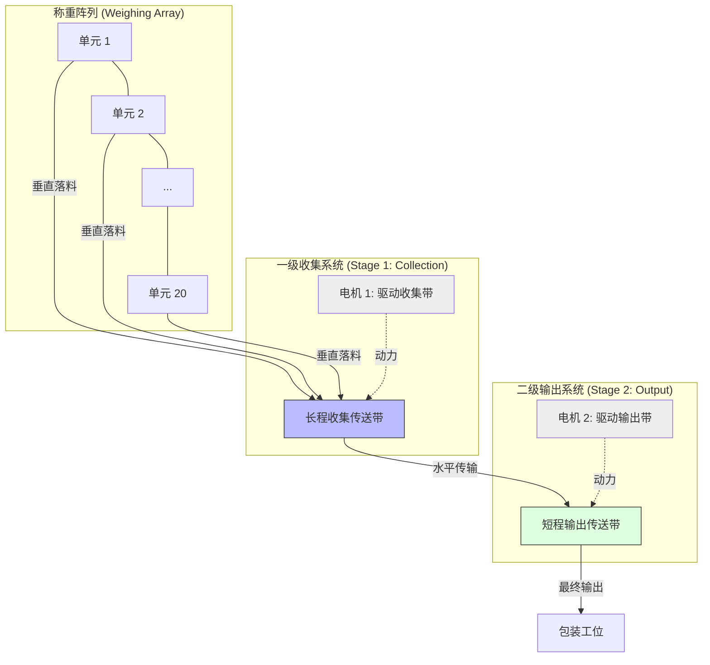

# 组合秤硬件布局与接线指南 (Hardware Layout & Wiring)

本文档描述了 20 个称重单元与双级输送带系统的物理排列及电气连接方式。

## 1. 物理布局 (Physical Layout)

根据 SolidWorks 设计模型 (`设备结构.PNG`)，系统采用**直线阵列**布局：

### 1.1 机械特征：
- **直线排列**：20 个称重料斗沿直线等间距排列。
- **阶梯式双皮带系统**：
  - **Belt 1 (收集带)**：全长覆盖称重阵列下方。当接收到组合落料后，必须运行足够距离（通常 > 180度转动轨迹），将物料全部倾泻至末端落料口。
  - **Belt 2 (输出带)**：位于 Belt 1 末端下方。它保持“静止”以接收来自 Belt 1 的落料。一旦接收完成，Belt 2 步进一个固定格位（例如 200mm/500mm），为下一组组合预留空位。
- **伺服控制**：采用 Modbus 伺服实现精确的位移管理，确保物料不会因惯性越界。

---

## 2. 电气接线 (Wiring)

### 2.1 Master HMI 配置
- **显示屏**: 128x64 OLED (I2C)
- **输入设备**: 带按键的旋转编码器 (A/B/SW pins)
  - CLK: GPIO 32
  - DT: GPIO 33
  - SW: GPIO 25

### 2.2 RS485 总线拓扑
- **统一总线**: 20 个称重从机、1 个主控以及 2 个传送带伺服电机全线挂载在同一条 RS485 总线上。
- **ID 分配**:
  - 称重单元: 1 - 20
  - 传送带 1 (Motor 1): 21
  - 传送带 2 (Motor 2): 22
- **连接方式**: 建议使用屏蔽双绞线，采用手拉手 (Daisy Chain) 方式，并接入 120Ω 终端电阻。

### 2.2 电源分配
- **逻辑电源**: 5V/3.3V 为控制器和传感器供电。
- **驱动电源**: 24V (或其他伺服专用电压) 为 485 伺服电机供电。
- **注意**: 由于伺服电机动力较强，务必确保电源功率充足并与控制器地线 (GND) 连通。

---

## 3. 机械参考 (Mechanical References)

> [!TIP]
> 如果您有 SolidWorks 的结构截图，请提供给我。我可以根据具体的机械构造（如：是否为圆周排列、漏斗的具体位置等）进一步优化本布局图。

下一步建议：
1. 确认输送带 1 和输送带 2 的动力源（当前代码按舵机模拟，若实际使用步进电机，需更新 `ConveyorController` 代码）。
2. 核对 RS485 屏蔽线的接地处理。
