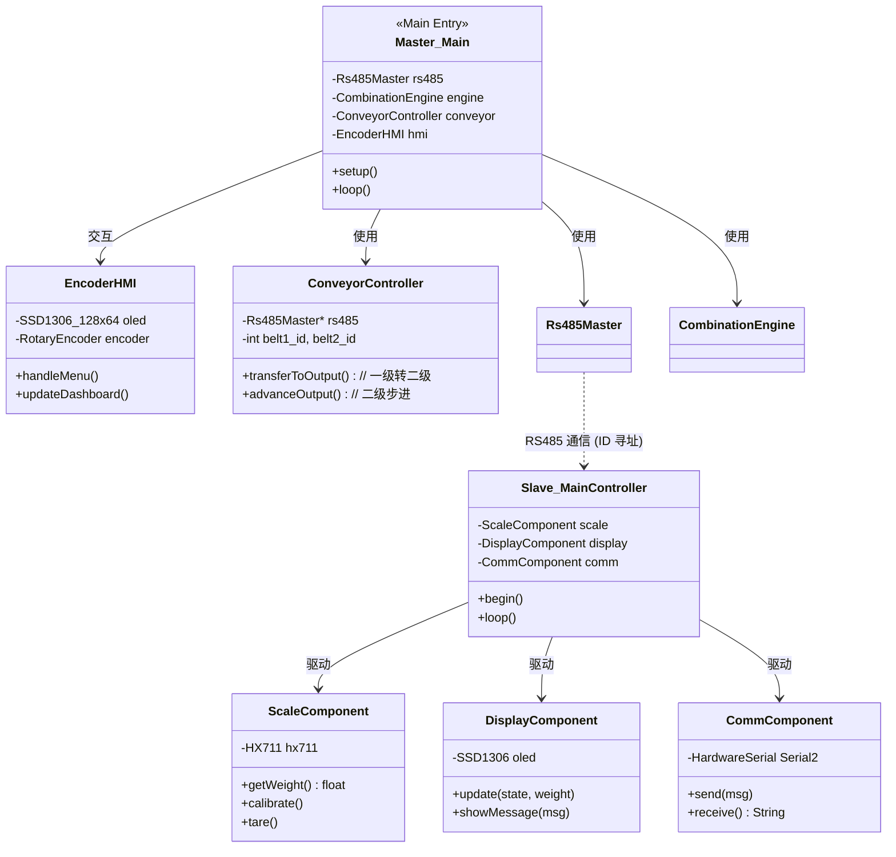

# 组合秤系统架构文档 (System Architecture)

本文档描述了组合秤系统的软件架构、类关系以及核心组件的功能。

## 1. 系统架构概览

系统采用主从架构 (Master-Slave)，通过 RS485 总线连接 1 个主控单元和 20 个称重从机单元。

## 2. 核心类说明

### 2.1 主控端 (Master)

- **`Rs485Master`**: 负责管理 RS485 总线上的所有通信。它封装了 ID 寻址协议，并处理请求超时。
- **`CombinationEngine`**: 系统的“大脑”。它接收所有从机的重量，并通过位掩码穷举搜索 (2^20 组合)，寻找最接近目标重量且不小于目标的最佳子集。
- **`ConveyorController`**: 控制两级输送带的舵机，确保排料后的物料能按顺序输送到传送带出口。

### 2.2 从机端 (Slave)

- **`MainController`**: 从机的逻辑核心。负责监听 RS485 总线，并在接收到匹配的 `ID` 时执行对应的硬件操作（称重、开关门、去皮）。同时处理本地的按键标定逻辑。
- **`ScaleComponent`**: 封装了 HX711 称重模块的操作，提供重量读取、去皮和标定功能。
- **`DisplayComponent`**: 驱动 0.96 寸 OLED 显示屏，实时显示当前重量、状态和通信反馈。
- **`CommComponent`**: 负责从机侧的硬件串口通信和 RS485 收发方向切换。

## 3. 关键交互流程

1. **轮询**: `Master_Main` 循环调用 `Rs485Master::getWeight(id)`。
2. **计算**: 收集完所有数据后，传递给 `CombinationEngine::findBestCombination()`。
3. **动作**: 若找到满足条件的组合，`Master_Main` 依次调用 `Rs485Master::openDischarge(id)`，随后触发 `ConveyorController::dischargeAndMove()`。
